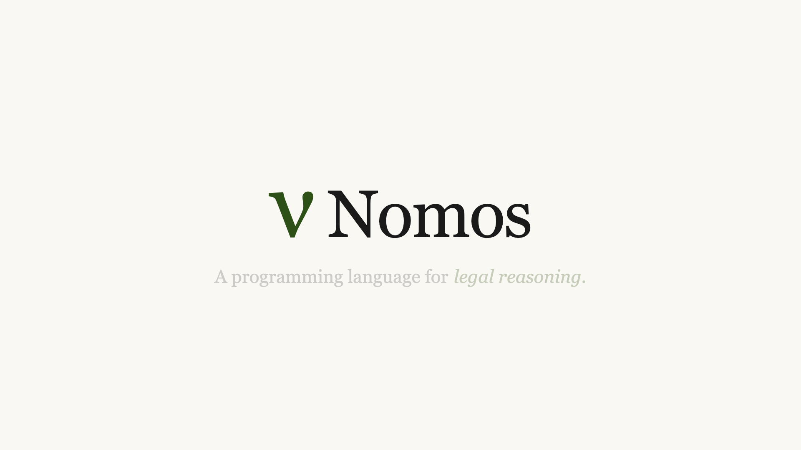
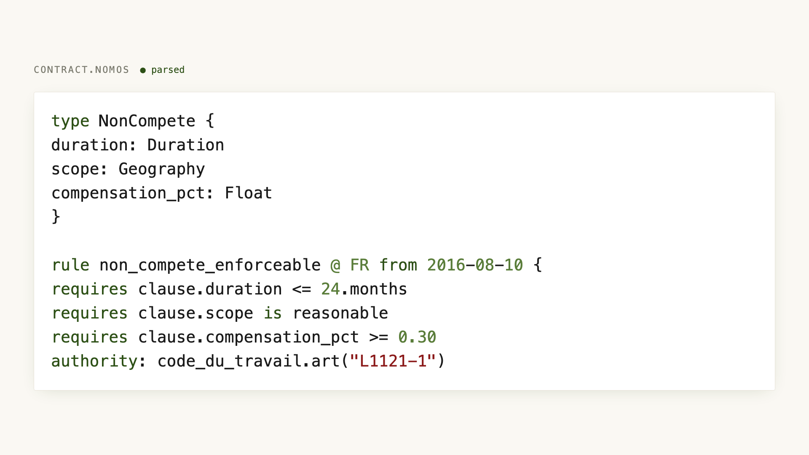
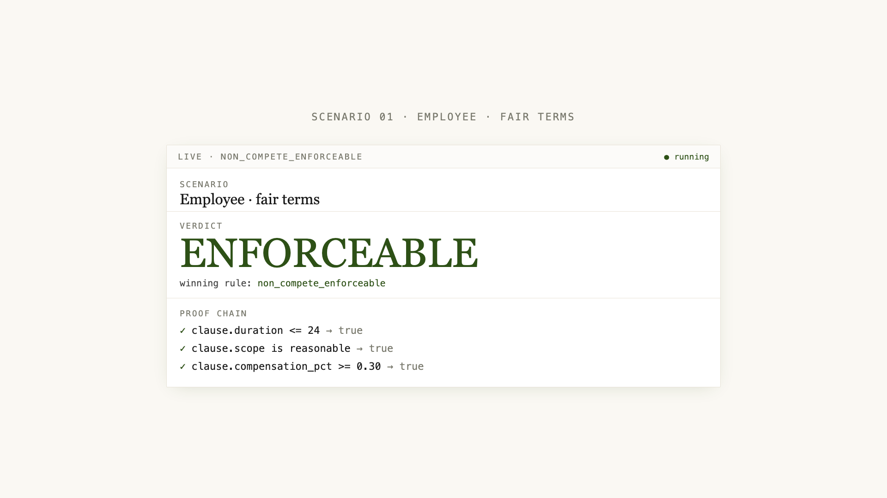
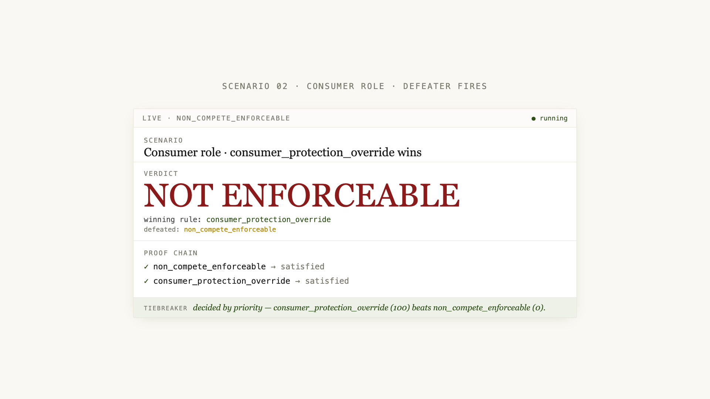
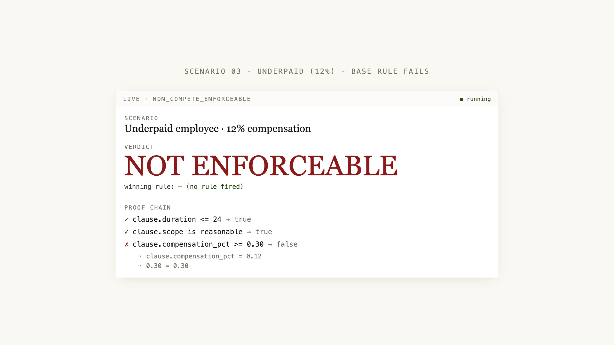
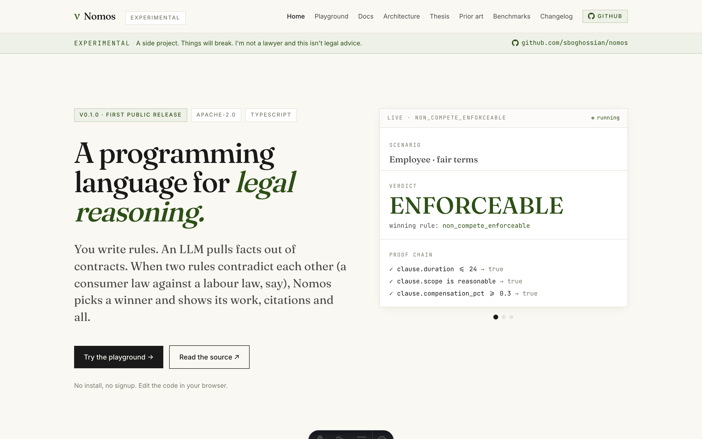

# Nomos — a programming language for legal reasoning

> **νόμος** — Greek, _noun_. Law, custom, rule.

**Nomos is an experimental programming language for encoding legal rules as
code.** Write typed rules with jurisdiction and validity dates. Extract facts
from prose via LLM calls that are first-class language primitives. Get
verdicts with proof trees that trace back to statutes and cases.

Built on top of fifty years of rules-as-code research: Catala (Inria),
OpenFisca (France), Blawx, Logical English (Kowalski), LegalRuleML, and the
1981 British Nationality Act encoding.

[](./LICENSE)
[](./tsconfig.base.json)
[](./packages/core/test)
[](./CHANGELOG.md)
[](https://nomos.dashable.dev/research/benchmarks)

**🌐 [nomos.dashable.dev](https://nomos.dashable.dev)** &nbsp;·&nbsp;
**🕹 [Playground](https://nomos.dashable.dev/play)** &nbsp;·&nbsp;
**🏛 [Architecture](https://nomos.dashable.dev/architecture)** &nbsp;·&nbsp;
**📊 [Benchmarks](https://nomos.dashable.dev/research/benchmarks)** &nbsp;·&nbsp;
**🔬 [Thesis](https://nomos.dashable.dev/research/thesis)**

---

## What it does, in 22 seconds

<p align="center">
  
</p>

<p align="center">
  <a href="./docs/media/demo.mp4">▶ 1080p MP4 (2.4 MB)</a>
  &nbsp;·&nbsp;
  <a href="https://nomos.dashable.dev/play">Try it live</a>
</p>

Six frames of the demo:

|                                                                                                   |                                                                                     |
| ------------------------------------------------------------------------------------------------- | ----------------------------------------------------------------------------------- |
| **Hero** <br/>                                | **Code** <br/>                  |
| **Enforceable** <br/>          | **Defeated** <br/>  |
| **Operand trace on failure** <br/>  | **Live pages** <br/>                 |

---

## Why Nomos exists

Legal reasoning is already a computation. Statutes define predicates. Facts
are inputs. Precedent is a priority ordering. Reforms are temporal updates.
Logic programming knew this in the 1970s and hit a wall: the world keeps
speaking in prose.

LLMs change what's possible — but only if you put them at the _edge_, not
the center. Nomos's thesis: **LLMs as typed primitives at the language's
border; deterministic defeasible logic inside; provenance threaded through
every value.** Four things nothing else has together:

1. **Typed LLM bridges** — `extract<Party>(pdf) using llm(...) verified_by human if confidence < 0.95` is a language primitive, not library plumbing. The compiler derives a JSON schema from the target type and routes low-confidence extractions to a human queue.
2. **Time + jurisdiction, typed** — rules declare `@ FR from 2016-08-10`; queries run `as of <date>`. The compiler refuses to apply a post-reform rule to a pre-reform fact.
3. **Defeasibility by design** — priority → specificity (lex specialis) → recency (lex posterior) → declaration order. Every tiebreak is explained in the proof tree.
4. **Provenance, always** — every value carries the authorities, facts, and rule chain that produced it. Ask the verdict _why_; get a tree back to statutes.

## Hello, Nomos

```nomos
type Party {
  name: String
  role: "seller" | "buyer" | "employee" | "employer" | "consumer"
}

type NonCompete {
  duration: Duration
  scope: Geography
  compensation_pct: Float
}

rule non_compete_enforceable @ FR from 2016-08-10 {
  requires clause.duration <= 24
  requires clause.scope is reasonable
  requires clause.compensation_pct >= 0.30
  authority: code_du_travail.art("L1121-1")
  authority: cass_soc(2002-07-10, "00-45135")
}

rule consumer_protection_override @ FR priority 100 defeats non_compete_enforceable when party.role == "consumer" {
  authority: code_conso.art("L212-1")
}

fact party: Party = extract<Party>(contract_text) using llm("claude-sonnet-4-5")
fact clause: NonCompete = extract<NonCompete>(contract_text, section: "non-compete")
  using llm("claude-sonnet-4-5") verified_by human if confidence < 0.95

query non_compete_enforceable as of 2026-04-18
```

Run it:

```bash
npx nomos run contract.nomos --with-llm --input facts.json
```

Given the same program and different fact sets, Nomos returns:

| Scenario                       | Verdict            | Winning rule                   | Why                                    |
| :----------------------------- | :----------------- | :----------------------------- | :------------------------------------- |
| Employee, 18mo, 35% comp       | ✅ ENFORCEABLE     | `non_compete_enforceable`      | All requires pass, no override fires   |
| Consumer role                  | ❌ NOT ENFORCEABLE | `consumer_protection_override` | Priority-100 defeater wins on priority |
| Employee, 12% comp (underpaid) | ❌ NOT ENFORCEABLE | —                              | `compensation_pct >= 0.30` fails       |

Every verdict ships with a proof tree naming the authorities, the facts
used, and the rules defeated.

**→ Try it live in your browser:** [nomos.dashable.dev/play](https://nomos.dashable.dev/play)

## Benchmarks — honest CUAD numbers

Cross-model run on the [CUAD dataset](https://www.atticusprojectai.org/cuad)
(Atticus Project, 20,910 Q/A pairs across 510 commercial contracts) —
10 samples × 4 categories × 3 models = **120 extractions**.
Reproduce: `node bench/cuad/harness.mjs --samples 10 --models claude-sonnet-4-5,gpt-4o,gemini-2-5-pro`.

| Model                         |   n | Exact match | Contains |       F1 | Conf |
| :---------------------------- | --: | ----------: | -------: | -------: | ---: |
| `anthropic/claude-sonnet-4.5` |  40 |    **0.47** |     0.72 | **0.64** | 0.98 |
| `openai/gpt-4o`               |  40 |        0.45 | **0.75** |     0.61 | 0.96 |
| `google/gemini-2.5-pro`       |  40 |        0.38 |     0.72 |     0.61 | 0.98 |

Frontier models are within 10 points of each other. Confidence is 0.96–0.98
across every cell, even when exact-match is 0.00 — which is why
[`extractEnsemble`](./packages/llm/src/ensemble.ts) (cross-model agreement)
is a much stronger signal than any single model's self-rated confidence.

Full per-category writeup:
[nomos.dashable.dev/research/benchmarks](https://nomos.dashable.dev/research/benchmarks).

## Quickstart

Requires **Node ≥ 20**. Optional: Python 3 + `pip install eyecite` for US citation resolution.

```bash
git clone https://github.com/sboghossian/nomos.git
cd nomos
npm install
npm run build

# Run an example (auto-detects sibling .input.json)
npx nomos run packages/core/test/fixtures/non_compete_fr.nomos

# Or the LLM-powered version (needs OPENROUTER_API_KEY)
echo "OPENROUTER_API_KEY=sk-or-..." > .env
npx nomos run packages/core/test/fixtures/non_compete_llm.nomos --with-llm

# Resolve US citations through Eyecite
npx nomos resolve packages/core/test/fixtures/us_equal_protection.nomos

# Serve the website + playground locally
npm run web    # http://localhost:4325/play
```

## The language

### Types

```nomos
type Party {
  name: String
  role: "seller" | "buyer" | "employee" | "employer" | "consumer"
}
type NonCompete {
  duration: Duration       // integer months
  scope: Geography         // { region: String, reasonable: Boolean }
  compensation_pct: Float
}
```

### Rules — with jurisdiction, validity, priority, defeats, guards

```nomos
rule non_compete_enforceable @ FR from 2016-08-10 {
  requires clause.duration <= 24
  requires clause.scope is reasonable
  authority: code_du_travail.art("L1121-1")
}

rule consumer_protection_override
  @ FR priority 100
  defeats non_compete_enforceable
  when party.role == "consumer"
{
  authority: code_conso.art("L212-1")
}
```

### Facts — plain values or LLM-extracted

```nomos
fact party: Party = extract<Party>(contract_text)
  using llm("claude-sonnet-4-5")
  verified_by human if confidence < 0.95
```

### Queries — pinned to a date

```nomos
query non_compete_enforceable as of 2026-04-18
```

### Defeasibility — the tiebreaker chain

When multiple rules fire, Nomos resolves in this order:

1. **Priority** — explicit `priority N`. Higher wins.
2. **Specificity** (_lex specialis_) — score = `requires + 2·when + defeats`. Higher wins.
3. **Recency** (_lex posterior_) — later `from` date wins.
4. **Declaration order** — last declared wins. Final fallback.

Every tiebreak is recorded in `result.tiebreaker` with a human-readable
summary.

## Install the Claude Skill

There's a Claude Skill at [`skills/nomos-reason/`](./skills/nomos-reason) that
teaches Claude to author and evaluate `.nomos` files. Drop it into your
Claude Code skills directory:

```bash
# option 1 — symlink from a clone
git clone https://github.com/sboghossian/nomos ~/src/nomos
mkdir -p ~/.claude/skills
ln -s ~/src/nomos/skills/nomos-reason ~/.claude/skills/nomos-reason

# option 2 — download the zipped release artifact
curl -L -o /tmp/nomos-reason.zip \
  https://github.com/sboghossian/nomos/releases/latest/download/nomos-reason.zip
mkdir -p ~/.claude/skills
unzip -o /tmp/nomos-reason.zip -d ~/.claude/skills/
```

Restart Claude Code and ask it to write a Nomos program. The trigger
description is broad enough that it picks up naturally on legal-encoding,
rule-conflict, and `.nomos`-editing conversations.

Full skill docs: [skills/nomos-reason/README.md](./skills/nomos-reason/README.md).

## Packages

| Package                                        | Description                                                                                          |
| :--------------------------------------------- | :--------------------------------------------------------------------------------------------------- |
| [`@nomos/core`](./packages/core)               | Lexer, parser, typed AST, evaluator, defeasibility solver                                            |
| [`@nomos/llm`](./packages/llm)                 | OpenRouter bridge for `extract<T>`                                                                   |
| [`@nomos/citations`](./packages/citations)     | Eyecite integration (US case law)                                                                    |
| [`@nomos/cli`](./packages/cli)                 | `nomos` command-line tool — `run`, `parse`, `check`, `resolve`                                       |
| [`nomos-vscode`](./packages/vscode)            | VS Code extension with LSP (syntax, hover, diagnostics, completion)                                  |
| [`@nomos/web`](./apps/web)                     | Website + browser playground at [nomos.dashable.dev](https://nomos.dashable.dev)                     |
| [`@nomos/api`](./apps/api)                     | Proxy server that holds the OpenRouter key for the playground                                        |
| [`skills/nomos-reason`](./skills/nomos-reason) | Claude Skill for [Lawvable's awesome-legal-skills](https://github.com/lawvable/awesome-legal-skills) |

## How it compares

| System                                            | Paradigm                      |   LLM bridge   |            Defeasibility            |   Temporal types    | License    |
| :------------------------------------------------ | :---------------------------- | :------------: | :---------------------------------: | :-----------------: | :--------- |
| **Nomos**                                         | Typed functional + defeasible | ✅ first-class | ✅ priority + specialis + posterior | ✅ `from` / `as of` | Apache-2.0 |
| [Catala](https://catala-lang.org/)                | Functional + default logic    |       ❌       |          ✅ default logic           |       partial       | Apache-2.0 |
| [OpenFisca](https://openfisca.org/)               | Python library                |       ❌       |                 ❌                  |         ❌          | AGPL       |
| [Blawx](https://app.blawx.dev/)                   | Visual → s(CASP)              |       ❌       |             ✅ via ASP              |         ❌          | MIT        |
| [Logical English](https://www.doc.ic.ac.uk/~rak/) | Controlled NL → Prolog        |       ❌       |               partial               |         ❌          | research   |
| LangGraph / LangChain                             | Agent orchestration           |  ✅ (untyped)  |                 ❌                  |         ❌          | MIT        |

See the full survey at [/research/prior-art](https://nomos.dashable.dev/research/prior-art).

## Use cases (and non-cases)

### Good fits

- Encoding statutes or contracts whose logic needs to be auditable
- Legal-AI agents that must cite their sources
- Compliance rule engines that need temporal + jurisdictional correctness
- Any workflow where an LLM extracts structured data and typed rules reason over it

### Not fits (yet)

- Production legal advice — this is experimental v0; always verify with counsel
- Jurisdictions with no declared rules — the language doesn't know law it hasn't been told
- Heavy natural-language reasoning tasks — LLMs stay at the edge, not inside the reasoning engine
- Real-time systems with strict latency budgets — LLM extraction is 2–5s per fact

## Status & roadmap

**v0.1.0** — first public release. See [CHANGELOG.md](./CHANGELOG.md) for the
full list.

Coming next:

- Specificity + semantic scoring (currently structural only)
- Akoma Ntoso legislation import
- Docassemble output adapter — Nomos program → guided interview
- Rule-pack marketplace (`nomos install @nomos/fr-labour`)
- Full CUAD + MAUD + ACORD benchmark sweep

Track: [GitHub issues](https://github.com/sboghossian/nomos/issues) · [Changelog](https://nomos.dashable.dev/changelog) · [Roadmap ideas](./tasks/todo.md)

## Contributing

Issues, discussions, and exploratory PRs welcome. Breaking changes expected
during v0. See [CONTRIBUTING.md](./CONTRIBUTING.md) (coming soon) for the
dev loop.

Key commands:

```bash
npm install           # set up workspace
npm test              # run 26 Vitest specs
npm run build         # build all packages
npm run web           # serve the site locally
```

## Citations & credit

If you reference Nomos, please credit the prior work it stands on:

- **Catala** — Merigoux, Chataing, Protzenko (2021). _Catala: a programming language for the law._ ICFP.
- **British Nationality Act** — Sergot, Sadri, Kowalski, Kriwaczek, Hammond, Cory (1986). _The British Nationality Act as a logic program._ Communications of the ACM. CodeX Prize 2021.
- **CUAD** — Hendrycks, Burns, Chen, Ball (2021). _CUAD: An Expert-Annotated NLP Dataset for Legal Contract Review._ NeurIPS.
- **Eyecite** — Free Law Project. [github.com/freelawproject/eyecite](https://github.com/freelawproject/eyecite).

Full prior-art survey: [nomos.dashable.dev/research/prior-art](https://nomos.dashable.dev/research/prior-art).

## Disclaimer

Nomos is an experimental side project. It is not legal advice, not
production software, and not a substitute for qualified counsel. Every
verdict depends entirely on the rules and facts the user supplies.
Always consult a licensed attorney for actual legal matters.

## License

[Apache-2.0](./LICENSE) © 2026 Stephane Boghossian.

---

**Keywords**: programming language, legal reasoning, rules-as-code,
defeasible logic, LLM, typed extraction, legal AI, compliance, contract
analysis, Catala alternative, OpenFisca alternative, legal tech, TypeScript,
Apache-2.0, open source, experimental.
